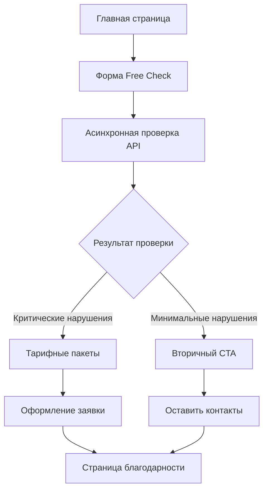

## 1. Обзор продукта

RegulaGuard - это высококонверсионная B2B посадочная страница для продажи экспертного аудита и консалтинга по 152-ФЗ. Сервис предоставляет автоматизированную технологическую проверку критических нарушений закона о персональных данных, с фокусом на самые высокие штрафные риски (до 15 млн руб.).

Целевая аудитория - юридические и IT-отделы компаний, заинтересованные в обеспечении соответствия требованиям Роскомнадзора. Продукт помогает компаниям избежать крупных штрафов и уголовной ответственности через быструю диагностику сайта и предоставление рекомендаций по устранению нарушений.

## 2. Основные функции

### 2.1 Пользовательские роли

| Роль                   | Метод регистрации  | Основные разрешения                                              |
| ---------------------- | ------------------ | ---------------------------------------------------------------- |
| Анонимный пользователь | Не требуется       | Доступ к бесплатной проверке сайта, просмотр контента            |
| Потенциальный клиент   | Через форму заявки | Доступ к платным услугам, получение отчетов                      |
| Администратор          | Внутренний доступ  | Управление контентом, просмотр заявок, управление пользователями |

### 2.2 Модуль функций

Основные страницы продукта:

1. **Главная страница**: 8-модульная структура с Hero Section, формой проверки, тарифами, кейсами и контактами
2. **Страница политики конфиденциальности**: Юридически обоснованный документ согласно 152-ФЗ
3. **Страница пользовательского соглашения**: Условия использования сервиса
4. **Страница благодарности**: Подтверждение отправки заявки

### 2.3 Детализация страниц

| Название страницы | Название модуля      | Описание функции                                                                                                                                                  |
| ----------------- | -------------------- | ----------------------------------------------------------------------------------------------------------------------------------------------------------------- |
| Главная страница  | Hero Section         | Отображение заголовка с рисками штрафов до 15 млн руб., подзаголовка с описанием нарушений, форма "Free Check" с обязательным чекбоксом согласия на обработку ПДн |
| Главная страница  | Таблица штрафов      | Отображение таблицы с видами нарушений и размерами штрафов (локализация - до 15 млн, согласие - до 1.5 млн, уголовная ответственность - до 4 лет)                 |
| Главная страница  | Механика работы      | 3-шаговый процесс: ввод URL → автоматическое сканирование → генерация отчета с акцентом на анализ POST-запросов                                                   |
| Главная страница  | Тарифные пакеты      | Три колонки: Standard Report (тех. аудит), Audit Pro (+юридические шаблоны), Monitoring (ежемесячный контроль)                                                    |
| Главная страница  | Кейсы и результаты   | 3 структурированных кейса с описанием проблемы, решения и результата, блок с отзывами                                                                             |
| Главная страница  | Экспертиза и команда | Фотографии и биографии экспертов с акцентом на опыт с регуляторами                                                                                                |
| Главная страница  | Вторичный CTA        | Форма сбора контактов с предложением чек-листа или консультации                                                                                                   |
| Главная страница  | Футер                | Юридические контакты, ссылки на документы, телефон, email                                                                                                         |

## 3. Основные процессы

### Поток анонимного пользователя

1. Пользователь заходит на главную страницу
2. Видит Hero Section с рисками и формой проверки
3. Вводит URL сайта и подтверждает согласие на обработку ПДн
4. Запускается асинхронная проверка через API
5. Получает предварительный результат или предложение оставить email
6. Переходит к просмотру тарифов и кейсов
7. Принимает решение о покупке услуги или оставляет контакты

### Поток клиента

1. Проходит бесплатную проверку
2. Получает детальный отчет с нарушениями
3. Выбирает подходящий тариф
4. Оформляет заявку на платную услугу
5. Получает полный аудит и рекомендации

## 4. Пользовательский интерфейс

### 4.1 Стиль дизайна

* **Основные цвета**: Глубокий корпоративный синий (#1e3a8a), темно-зеленый (#065f46) или золотистый (#d97706) для акцентов

* **Вторичные цвета**: Оттенки серого (#6b7280, #374151) и антрацита (#1f2937)

* **Стиль кнопок**: Строгие, с закругленными углами, тень для создания объема

* **Типографика**: Строгие, технические шрифты (Inter, Roboto), размеры от 14px для текста до 48px для заголовков

* **Визуальные метафоры**: Щит, замок, спирали, чистые геометрические формы

* **Макет**: Карточная структура с четкой иерархией, верхняя навигация

### 4.2 Обзор дизайна страниц

| Название страницы | Название модуля | UI элементы                                                                                                     |
| ----------------- | --------------- | --------------------------------------------------------------------------------------------------------------- |
| Главная страница  | Hero Section    | Заголовок 48px синего цвета, белый фон с градиентом, форма с тенью, чекбокс с красной звездочкой обязательности |
| Главная страница  | Таблица штрафов | Таблица с серыми заголовками, красными суммами штрафов, иконки предупреждений                                   |
| Главная страница  | Тарифы          | Карточки с зеленой обводкой для рекомендуемого тарифа, кнопки CTA оранжевого цвета                              |
| Главная страница  | Формы           | Инпуты с синей рамкой при фокусе, валидация красным цветом, лоадер при отправке                                 |

### 4.3 Адаптивность

* Mobile-first подход с адаптацией под десктоп&#x20;

* Breakpoints: 768px, 1024px, 1440px

* Мобильная версия с приоритетом на читаемость юридического контента

* Оптимизация касаний для форм и кнопок (минимум 44px)

* Скрытие не критичных элементов на мобильных для улучшения производительности

