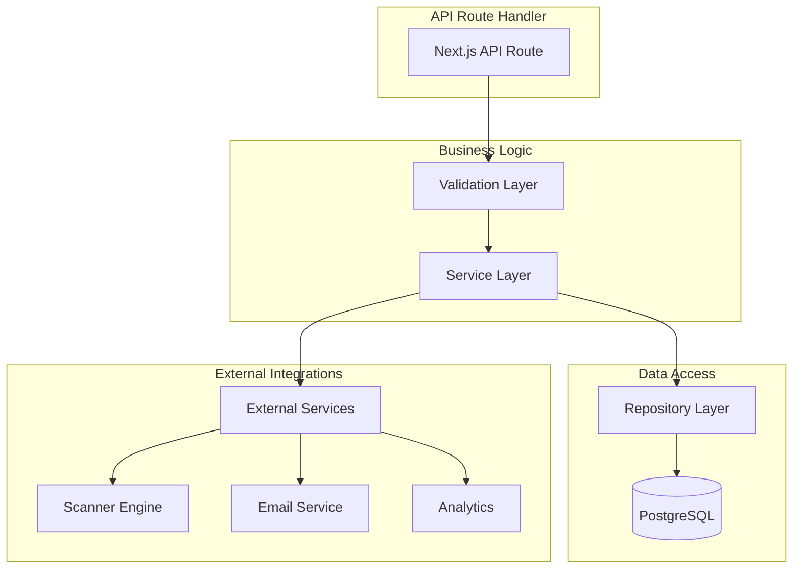
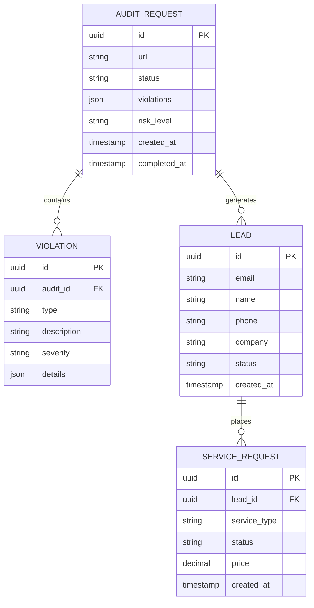

## 1. Архитектура проекта

```mermaid
graph TD
  A[User Browser] --> B[Next.js Frontend]
  B --> C[API Routes]
  C --> D[Backend Services]
  D --> E[Database]
  D --> F[Scanner Engine]
  
  subgraph "Frontend Layer"
    B --> G[React Components]
    B --> H[TypeScript Types]
    B --> I[SCSS Modules]
  end
  
  subgraph "API Layer"
    C --> J[/api/start-audit]
    C --> K[/api/get-report-status]
    C --> L[/api/submit-lead]
  end
  
  subgraph "Service Layer"
    D --> M[Audit Service]
    D --> N[Lead Management]
    D --> O[Compliance Validator]
  end
  
  subgraph "Data Layer"
    E --> P[PostgreSQL]
    E --> Q[Redis Cache]
  end
```

## 2. Технологический стек

* **Frontend**: Next.js 16 + React 19 + TypeScript 5, App Router, PNPM as package manager

* **Стили**: CSS Modules + Tailwind CSS 4

* **Инициализация**: create-next-app

* **Backend**: Next.js API Routes + Node.js

* **База данных**: PostgreSQL (через Supabase)

* **Кеширование**: Redis

* **Валидация**: Zod

* **HTTP клиент**: Axios

* **Анимации**: Framer Motion

## 3. Определение маршрутов

| Маршрут                | Назначение                                  |
| ---------------------- | ------------------------------------------- |
| /                      | Главная страница с 8-модульной структурой   |
| /privacy-policy        | Страница политики конфиденциальности        |
| /terms                 | Пользовательское соглашение                 |
| /thank-you             | Страница благодарности за заявку            |
| /api/start-audit       | Запуск асинхронной проверки сайта           |
| /api/get-report-status | Получение статуса проверки                  |
| /api/submit-lead       | Сохранение контактов потенциального клиента |

## 4. Определение API

### 4.1 Запуск аудита

```
POST /api/start-audit
```

Запрос:

| Параметр | Тип     | Обязательный | Описание                  |
| -------- | ------- | ------------ | ------------------------- |
| url      | string  | true         | URL сайта для проверки    |
| consent  | boolean | true         | Согласие на обработку ПДн |
| email    | string  | false        | Email для отправки отчета |

Ответ:

| Параметр | Тип     | Описание              |
| -------- | ------- | --------------------- |
| success  | boolean | Статус операции       |
| auditId  | string  | ID асинхронной задачи |
| status   | string  | Статус проверки       |

Пример:

```json
{
  "url": "https://example.com",
  "consent": true,
  "email": "client@company.ru"
}
```

### 4.2 Получение статуса отчета

```
GET /api/get-report-status?id={auditId}
```

Параметры запроса:

| Параметр | Тип    | Обязательный | Описание    |
| -------- | ------ | ------------ | ----------- |
| id       | string | true         | ID проверки |

Ответ:

| Параметр   | Тип    | Описание                                     |
| ---------- | ------ | -------------------------------------------- |
| status     | string | Статус проверки (pending, completed, failed) |
| violations | array  | Массив найденных нарушений                   |
| riskLevel  | string | Уровень риска (low, medium, high, critical)  |
| summary    | string | Краткое описание результатов                 |

### 4.3 Сохранение лида

```
POST /api/submit-lead
```

Запрос:

| Параметр | Тип    | Обязательный | Описание             |
| -------- | ------ | ------------ | -------------------- |
| name     | string | true         | Имя контактного лица |
| email    | string | true         | Email                |
| phone    | string | false        | Телефон              |
| company  | string | false        | Название компании    |
| service  | string | true         | Интересующая услуга  |

## 5. Архитектура сервера



## 6. Модель данных

### 6.1 Определение сущностей



### 6.2 SQL DDL

Таблица аудитов (audit\_requests):

```sql
CREATE TABLE audit_requests (
    id UUID PRIMARY KEY DEFAULT gen_random_uuid(),
    url VARCHAR(500) NOT NULL,
    status VARCHAR(50) NOT NULL DEFAULT 'pending',
    violations JSONB DEFAULT '[]',
    risk_level VARCHAR(20) DEFAULT 'unknown',
    created_at TIMESTAMP WITH TIME ZONE DEFAULT NOW(),
    completed_at TIMESTAMP WITH TIME ZONE,
    email VARCHAR(255),
    consent_given BOOLEAN NOT NULL DEFAULT true
);

CREATE INDEX idx_audit_requests_status ON audit_requests(status);
CREATE INDEX idx_audit_requests_created_at ON audit_requests(created_at DESC);
CREATE INDEX idx_audit_requests_email ON audit_requests(email);
```

Таблица нарушений (violations):

```sql
CREATE TABLE violations (
    id UUID PRIMARY KEY DEFAULT gen_random_uuid(),
    audit_id UUID REFERENCES audit_requests(id) ON DELETE CASCADE,
    type VARCHAR(100) NOT NULL,
    description TEXT NOT NULL,
    severity VARCHAR(20) NOT NULL CHECK (severity IN ('low', 'medium', 'high', 'critical')),
    details JSONB DEFAULT '{}',
    created_at TIMESTAMP WITH TIME ZONE DEFAULT NOW()
);

CREATE INDEX idx_violations_audit_id ON violations(audit_id);
CREATE INDEX idx_violations_type ON violations(type);
CREATE INDEX idx_violations_severity ON violations(severity);
```

Таблица лидов (leads):

```sql
CREATE TABLE leads (
    id UUID PRIMARY KEY DEFAULT gen_random_uuid(),
    email VARCHAR(255) UNIQUE NOT NULL,
    name VARCHAR(255) NOT NULL,
    phone VARCHAR(50),
    company VARCHAR(255),
    status VARCHAR(50) DEFAULT 'new',
    source VARCHAR(100) DEFAULT 'landing',
    created_at TIMESTAMP WITH TIME ZONE DEFAULT NOW(),
    updated_at TIMESTAMP WITH TIME ZONE DEFAULT NOW()
);

CREATE INDEX idx_leads_email ON leads(email);
CREATE INDEX idx_leads_status ON leads(status);
CREATE INDEX idx_leads_created_at ON leads(created_at DESC);
```

## 7. Компонентная архитектура

### 7.1 Структура компонентов

```
app/
├── components/
│   ├── ui/
│   │   ├── Button
│   │   ├── Input
│   │   ├── Checkbox
│   │   └── Card
│   ├── sections/
│   │   ├── HeroSection
│   │   ├── PenaltiesTable
│   │   ├── HowItWorks
│   │   ├── PricingCards
│   │   ├── CaseStudies
│   │   ├── Team
│   │   ├── SecondaryCTA
│   │   └── Footer
│   ├── forms/
│   │   ├── AuditForm.tsx
│   │   └── LeadForm.tsx
│   └── layout/
│       ├── Header.tsx
│       └── Layout.tsx
├── (routes)/
│   ├── (home)
│   ├── privacy-policy
│   ├── terms
│   └── thank-you
├── api/
│   ├── start-audit.ts
│   ├── get-report-status.ts
│   └── submit-lead.ts
├── lib/
│   ├── scanner.ts
│   ├── validator.ts
│   └── email.ts
└── types/
    ├── audit.ts
    ├── lead.ts
    └── api.ts
```

### 7.2 Критические компоненты

**AuditForm Component**:

* Валидация URL с поддержкой русских доменов

* Обязательный чекбокс согласия (не отмечен по умолчанию)

* Анимация загрузки при отправке

* Обработка ошибок с юридически корректными сообщениями

**PenaltiesTable Component**:

* Таблица с штрафами по 152-ФЗ

* Сортировка по размеру штрафа

* Адаптивность для мобильных устройств

* Иконки предупреждений для критических нарушений

**PricingCards Component**:

* Три тарифа с четким разделением функций

* Выделение рекомендуемого тарифа

* Кнопки CTA с различными текстами

* Мобильная адаптивность

## 8. Требования к безопасности и соответствию

### 8.1 Юридические требования

* Обязательный чекбокс согласия на обработку ПДн (ст. 13.11 КоАП РФ)

* Ссылка на политику конфиденциальности в футере (ст. 7 152-ФЗ)

* Защита от автоматического заполнения форм

* Логирование всех действий пользователей

* Шифрование персональных данных

### 8.2 Технические требования

* HTTPS обязателен для всех страниц

* CSP заголовки для защиты от XSS

* Rate limiting на API endpoints

* Валидация всех входных данных

* Защита от SQL инъекций

* Обфускация email адресов в публичной части

## 9. SEO и производительность

### 9.1 SEO оптимизация

* SSR/SSG для всех статических страниц

* Оптимизированные мета-теги для "проверка 152-ФЗ", "штрафы Роскомнадзора 2025"

* Структурированные данные (JSON-LD)

* XML sitemap

* Оптимизированные изображения (WebP, lazy loading)

### 9.2 Производительность

* Core Web Vitals оптимизация

* Минимизация JavaScript

* Оптимизация шрифтов (preload, font-display: swap)

* Кеширование статических ресурсов

* CDN для изображений и статики

